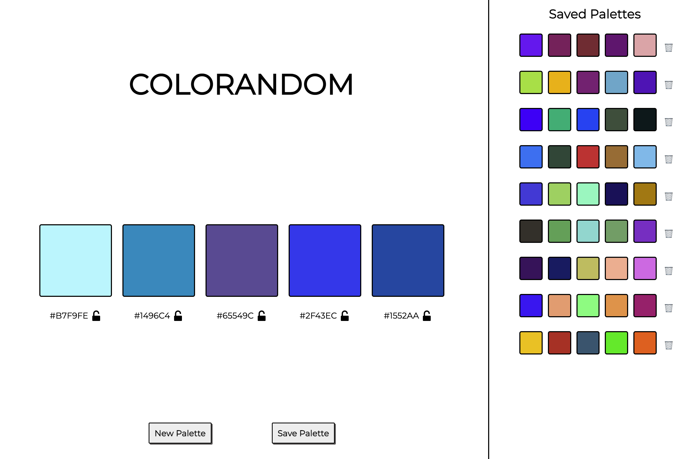

______________________________________________________  

# ColoRandom   

### Abstract:
This Application was made with the purpose of generating random color palettes. It also has additional features of locking certain colors, saving the palettes, and even giving the user the ability to delete specific saved palettes. 

### Installation Instructions:
1. Fork this Repo
1. Open terminal and navigate where you would like to store the application. 
1. Click `SSH` and copy and paste `git clone git@github.com:SleepyisAwak3/ColoRandom.git` into your terminal.
1. Type the phrase `open index.html` into your terminal to open the test window of the application.

## **Or**

Simply use this [Deployable Link](https://sleepyisawak3.github.io/ColoRandom/)

### Preview of App:

### Context:

This project was completed in 21 hours during week 4 of the Turing program.

### Contributors:

- [Amber](https://github.com/Espressogoddess)

- [Sam](https://github.com/SamanthaMcElhinney)

- [Michael](https://github.com/mrlobatoman)

- [Noah](https://github.com/SleepyisAwak3)

### Learning Goals:

- Navigate a group project enviroment.
- Problem Solving with new challenges.
- Continue and gain a deeper understanding with CSS, Javascript, and HTML. 

### Wins + Challenges:

#### Wins
- We were able to deepen our understanding of the connection between the Data Model and the DOM. We also now understand the importance of updating the DOM directly based upon the Data Model.
- We progressed in working collaboratively as a team. We were able to see the value by gaining new understanding from teammates and their ways of thinking.
- We successfully navigated working collaboratively with multiple people's schedules by remaining flexible and adaptable.

#### Challenges:
- We originally had a tough time getting the specific color to change to `locked=true` in the data model. We decided to add a data attribute to the color boxes, which corresponded to the specific lock.
- We had a hard time successfully implementing the use of flexbox with so many elements/parents/grandparents at play. We ultimately broke the code down to see which elements we needed to target based on the direct parent/child relationship.
- Another challenge was figuring out how to compile numbers and letters together along with `#` since letters are strings and numbers are integers. We found a way to compile them together, and our issue was solved.